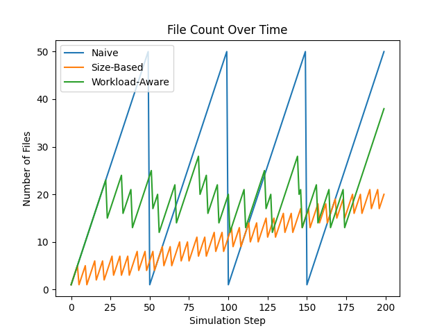
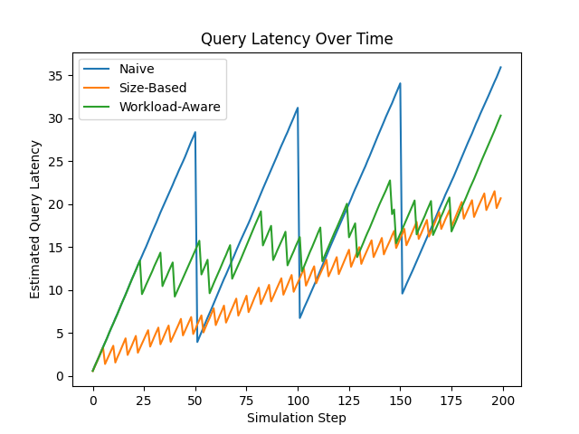

# Mini-AutoComp: Automated Compaction Simulator for Log-Structured Tables

A lightweight simulation framework inspired by the AutoComp paper ("Automated Data Compaction for Log-Structured Tables in Data Lakes") that demonstrates different compaction strategies for managing small files in log-structured storage systems.

## Overview

This project simulates the small file problem in data lakes and evaluates three different compaction policies:

- **Naive Compaction**: Triggers compaction when file count exceeds a threshold
- **Size-Based Compaction**: Considers both file count and total data size
- **Workload-Aware Compaction**: Adapts based on read/write patterns

The simulator generates performance metrics and visualizations comparing these strategies under different workload scenarios.

## Project Structure

```
mini-autocomp/
│
├── src/
│   ├── experiments/
│   │   └── run_experiments.py    # Main experiment runner
│   ├── table.py                   # Log-structured table implementation
│   ├── workload.py                # Workload generator
│   ├── simulator.py               # Simulation engine
│   └── compaction/                # Compaction policy implementations
│       ├── naive.py
│       ├── size_based.py
│       └── workload_aware.py
│
├── data/
│   └── synthetic_workload.json    # Workload configurations
│
├── results/
│   └── plots/                     # Generated visualization plots
│       ├── file_count.png
│       └── query_latency.png
│
└── .venv/                         # Python virtual environment
```

## Installation

1. **Clone the repository:**
   ```bash
   git clone https://github.com/Mehboob786/mini-autocomp.git
   cd mini-autocomp
   ```

2. **Create and activate virtual environment:**
   ```bash
   python3 -m venv .venv
   source .venv/bin/activate  # On Windows: .venv\Scripts\activate
   ```

3. **Install dependencies:**
   ```bash
   pip install matplotlib numpy
   ```

## Configuration

### Synthetic Workload Configuration

Create `data/synthetic_workload.json` with your workload scenarios:

```json
{
  "workloads": [
    {
      "name": "write-heavy",
      "write_rate": 10,
      "read_rate": 2,
      "steps": 100
    },
    {
      "name": "read-heavy",
      "write_rate": 3,
      "read_rate": 15,
      "steps": 100
    },
    {
      "name": "balanced",
      "write_rate": 5,
      "read_rate": 5,
      "steps": 100
    }
  ]
}
```

**Parameters:**
- `name`: Descriptive name for the workload
- `write_rate`: Number of write operations per simulation step
- `read_rate`: Number of read operations per simulation step
- `steps`: Total number of simulation steps to run

## Running the Simulation

From the project root directory:

```bash
python src/experiments/run_experiments.py
```

**Expected Output:**
```
Completed workload: write-heavy
Completed workload: read-heavy
Completed workload: balanced
```

## Results

The simulation generates two plots in `results/plots/`:

1. **file_count.png**: Shows how the number of files grows over time for each compaction strategy
2. **query_latency.png**: Displays estimated query latency trends for each strategy

These visualizations help compare the effectiveness of different compaction policies under various workload patterns.

### Sample Results

#### File Count Over Time


**Interpretation:**
- **Lower is better** - Fewer files mean better query performance
- Naive policy may allow excessive file accumulation
- Size-based policy maintains moderate file counts
- Workload-aware policy adapts to read/write patterns dynamically

#### Query Latency Over Time


**Interpretation:**
- **Lower is better** - Reduced latency means faster queries
- Latency typically correlates with file count
- Workload-aware policies should show better latency under variable workloads
- Trade-off: More aggressive compaction reduces latency but consumes resources

### Quick Test Output

Running `python src/main.py` with a read-heavy workload (5 writes, 20 reads):

```python
[
  {'files': 15, 'latency': 13.207},
  {'files': 16, 'latency': 13.769},
  {'files': 17, 'latency': 14.344},
  {'files': 18, 'latency': 14.913},
  {'files': 19, 'latency': 15.493}
]
```

This demonstrates how file accumulation directly impacts query performance, validating the need for effective compaction strategies.

## Key Concepts

### The Small File Problem

In log-structured storage systems (like Delta Lake, Apache Iceberg, Apache Hudi), append-only writes create many small files over time. This leads to:
- Degraded query performance (more files to scan)
- Increased metadata overhead
- Higher storage costs
- Scalability bottlenecks

### Compaction

Compaction merges small files into larger ones, improving:
- Query performance (fewer files to read)
- Storage efficiency (better compression, less metadata)
- System scalability

However, compaction has costs:
- CPU and I/O resources during merge operations
- Temporary storage for compacted files
- Potential interference with concurrent operations

### Compaction Strategies Simulated

1. **Naive Compaction**: Simple threshold-based triggering
   - Pros: Easy to implement
   - Cons: May compact unnecessarily or too late

2. **Size-Based Compaction**: Considers data volume
   - Pros: More informed decisions
   - Cons: Still doesn't adapt to workload patterns

3. **Workload-Aware Compaction**: Adapts to read/write patterns
   - Pros: Optimizes based on actual usage
   - Cons: More complex to implement and tune

## Extending the Project

### Adding New Compaction Policies

1. Create a new file in `src/compaction/` (e.g., `custom_policy.py`)
2. Implement the policy interface
3. Import and add to `run_experiments.py`:

```python
from compaction.custom_policy import CustomPolicy

histories = {
    "Naive": run_simulation(NaiveCompaction(), wl),
    "Size-Based": run_simulation(SizeBasedCompaction(), wl),
    "Workload-Aware": run_simulation(WorkloadAwareCompaction(), wl),
    "Custom": run_simulation(CustomPolicy(), wl)
}
```

### Adding New Metrics

Modify `simulator.py` to track additional metrics and update plotting in `run_experiments.py`.

## Research Connection

This project demonstrates core concepts from the AutoComp paper:
- Trade-offs between compaction benefits and costs
- Impact of workload patterns on optimal compaction strategies
- Importance of automated, adaptive compaction in modern data lakes

The simulation provides insights into why sophisticated compaction frameworks like AutoComp are necessary for production data lake systems at scale.

## Troubleshooting

**Issue:** `ModuleNotFoundError: No module named 'table'`
- **Solution:** Ensure you're running from the project root: `python src/experiments/run_experiments.py`

**Issue:** `FileNotFoundError: synthetic_workload.json`
- **Solution:** Create the `data/` directory and add `synthetic_workload.json` with valid workload configurations

**Issue:** `FileNotFoundError: results/plots/file_count.png`
- **Solution:** The script now automatically creates the directory, but ensure you have write permissions

## Future Enhancements

- Real-time visualization during simulation
- Support for more complex workload patterns
- Integration with actual storage backends
- Multi-dimensional optimization (cost, performance, resource usage)
- Distributed compaction simulation

## Author

**Mehboob Ahmad**
- Email: mehboobmaitla@gmail.com
- LinkedIn: https://www.linkedin.com/in/mehboob-maitla/
- GitHub: [Mehboob786](https://github.com/Mehboob786)

## Acknowledgments

Inspired by the AutoComp paper by Professor Daniel Abadi and team at the University of Maryland and LinkedIn, which addresses automated data compaction for log-structured tables in production data lakes.

## License

This project is for educational and research purposes.